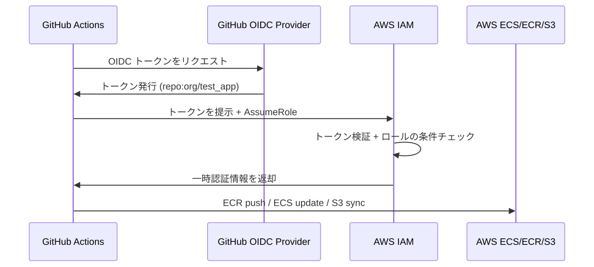

# なぜこのリポジトリで AWS デプロイが可能なのか — 仕組みの完全解説

> **対象読者**: Terraform と GitHub Actions のコードは書いたが、「なぜこれでデプロイできるのか」が分からない方  
> **前提**: [task2-aws-deploy-guide.md](./task2-aws-deploy-guide.md) に沿って Terraform コードと CI/CD ワークフローが作成済み

---

## 目次

- [1. 全体の流れ — 2 段階のデプロイ](#1-全体の流れ--2-段階のデプロイ)
- [2. 疑問 1: Terraform ファイルはどこで実行されるのか](#2-疑問-1-terraform-ファイルはどこで実行されるのか)
- [3. 疑問 2: どうやって「自分のアカウント」にリソースが作られるのか](#3-疑問-2-どうやって自分のアカウントにリソースが作られるのか)
- [4. 全体の流れを時系列で追う](#4-全体の流れを時系列で追う)
- [5. まとめ](#5-まとめ)

---

## 1. 全体の流れ — 2 段階のデプロイ

AWS へのデプロイは **2 つの独立した段階** で構成されます。多くの人が混乱するのは、この 2 段階を 1 つのものと捉えてしまうからです。



| 段階 | 実行者 | 実行場所 | 頻度 | 何をするか |
|------|--------|---------|------|-----------|
| **第 1 段階** | **あなた（手動）** | **ローカル PC のターミナル** | **初回 1 回 + 変更時** | Terraform で AWS リソースを作成 |
| **第 2 段階** | GitHub Actions（自動） | GitHub のサーバー | main への push ごと | アプリコードをビルド→デプロイ |

> **核心**: Terraform は GitHub Actions の中では実行されていません。Terraform はあなたのローカル PC で手動実行します。GitHub Actions が担うのは「アプリコードの CI/CD」だけです。

---

## 2. 疑問 1: Terraform ファイルはどこで実行されるのか

### 2.1 Terraform は「ローカル PC」で実行する

あなたの疑問:
> `.github/workflows/deploy.yml` に Terraform の実行コマンドがないのに、AWS リソースは作成されるのか？

**回答: その通り、deploy.yml からは AWS リソースは作成されません。** deploy.yml の中に `terraform` コマンドは一切書かれていません。これは意図的な設計です。

Terraform の実行手順は以下の通りです:

```bash
# 1. あなたのローカル PC で、ターミナルを開く
cd infrastructure/environments/production

# 2. Terraform を初期化（プロバイダのダウンロード、state の接続）
terraform init

# 3. 変更内容を確認（何が作られるかのプレビュー）
terraform plan

# 4. 実際に AWS リソースを作成
terraform apply
# → "Do you want to perform these actions?" と聞かれる
# → "yes" と入力
# → VPC, ECS, RDS, S3, CloudFront, IAM ロール... が AWS 上に作成される
```

### 2.2 なぜ GitHub Actions に Terraform を入れないのか

「deploy.yml で terraform apply も実行すればいいのでは？」と思うかもしれません。分離する理由は:

| 理由 | 説明 |
|------|------|
| **リスク管理** | `terraform apply` は VPC やデータベースを作成/変更/削除する。CI/CD で自動実行すると、コードの誤りが即座にインフラ破壊につながる |
| **承認フロー** | `terraform plan` の結果を人間が確認してから `apply` する、というステップが必要 |
| **頻度の違い** | インフラ変更は月に数回、アプリデプロイは日に数回。ライフサイクルが違う |
| **権限の違い** | Terraform には AdministratorAccess 級の権限が必要。CI/CD のデプロイロールにはそこまで渡さない |

> 💡 **大規模チームでは** Terraform 専用の CI/CD パイプライン（`terraform plan` を PR で自動実行し、マージ時に `apply`）を構築しますが、個人・小規模チームではローカル実行で十分です。

### 2.3 deploy.yml の役割

deploy.yml は Terraform が「すでに作った」インフラに対して、アプリケーションをデプロイします:

```
deploy.yml が行うこと:
1. テスト実行
2. Docker イメージをビルド
3. ビルドしたイメージを ECR（コンテナレジストリ）に push
4. ECS サービスに「新しいイメージを使え」と指示
5. フロントエンドを S3 にアップロード
6. CloudFront のキャッシュを無効化
```

つまり deploy.yml は、Terraform が作った「箱」に中身を入れる作業を自動化しています。

---

## 3. 疑問 2: どうやって「自分のアカウント」にリソースが作られるのか

### 3.1 Terraform の認証: AWS CLI の設定を使う

あなたの疑問:
> ログイン手順がないのに、そのユーザーの AWS アカウントにリソースが作られるのはなぜ？

**回答: Terraform は `aws configure` で設定済みの認証情報を自動的に使います。**

事前準備の段階で以下を実行しています:

```bash
aws configure
# AWS Access Key ID: AKIA...     ← あなたの IAM ユーザーのキー
# AWS Secret Access Key: xxxx    ← あなたの IAM ユーザーのシークレット
# Default region name: ap-northeast-1
```

この認証情報は `~/.aws/credentials` に保存されます。Terraform は起動時にこのファイルを自動的に読み込み、その認証情報で AWS API を呼び出します。


つまり:
- **Terraform のコードにはログイン情報を書かない**（セキュリティ上、コードに秘密情報を含めない）
- **ローカル PC に設定済みの AWS 認証情報が自動的に使われる**
- **認証情報に紐づく AWS アカウントにリソースが作られる**

### 3.2 GitHub Actions の認証: OIDC (パスワードなしの認証)

deploy.yml の方は別の仕組みで認証しています:

```yaml
# deploy.yml より抜粋
- uses: aws-actions/configure-aws-credentials@v4
  with:
    role-to-assume: ${{ secrets.AWS_DEPLOY_ROLE_ARN }}
    aws-region: ap-northeast-1
```

これは **OIDC (OpenID Connect)** という仕組みで:

1. GitHub Actions が「私は `your-org/test_app` リポジトリの main ブランチで実行されているワークフローです」という証明トークンを発行
2. AWS がそのトークンを検証し、「このリポジトリからのリクエストなら IAM ロール `test-app-github-actions-deploy` の権限を与える」と判断
3. GitHub Actions は一時的な認証情報を取得し、AWS API を操作する

**パスワードもアクセスキーも不要** — GitHub と AWS の間の信頼関係だけで認証が成立します。この信頼関係を作るのが、Terraform の IAM モジュールです。



### 3.3 なぜ OIDC で「特定のアカウント」に紐づくのか

> この疑問は多くの初学者が持つ重要な点です。

**答え: IAM ロールの ARN にアカウント ID が含まれているからです。**

```
secrets.AWS_DEPLOY_ROLE_ARN の値:
arn:aws:iam::123456789012:role/test-app-github-actions-deploy
             ^^^^^^^^^^^^
             ここがあなたのアカウント ID
```

GitHub Actions が `role-to-assume` に上記 ARN を指定すると、AWS は「アカウント 123456789012 にあるロールを引き受けたい」と解釈します。そして：

1. **そのアカウントに OIDC プロバイダが登録されているか** → terraform apply で作成済み
2. **そのロールの信頼ポリシーが、このリポジトリからのリクエストを許可しているか** → terraform apply で設定済み
3. 両方 OK なら → 一時認証情報を発行

つまり **「どのアカウント」への紐づけは、以下の 2 点で確立されます:**

| 紐づけの契機 | 誰がやるか | 何が起きるか |
|------------|-----------|------------|
| `terraform apply` | あなた（手動） | あなたのアカウント内に「GitHub を信頼する」設定が作られる |
| GitHub Secrets に ARN を登録 | あなた（手動） | deploy.yml が「あなたのアカウントのロール」を使うことを指定する |

**この 2 つの手動設定がなければ、GitHub Actions はあなたのアカウントを操作できません。** これが OIDC のセキュリティモデルです — 双方向の合意（AWS 側の信頼ポリシー + GitHub 側のロール ARN 指定）が必要です。

> 💡 **別の人のアカウントに間違えてデプロイすることはない**: (1) あなたの AWS アカウントに OIDC プロバイダが登録されていなければ GitHub は接続できない、(2) ARN が別のアカウントを指していればそのアカウントの信頼ポリシーが拒否する。

---

## 4. 全体の流れを時系列で追う

以下が、ゼロから本番稼働までの完全な時系列です:

### Step 1: 事前準備（1 回だけ、手動）

```
あなたのPC:
  1. AWS アカウント作成 + MFA 有効化
  2. IAM ユーザー作成 + アクセスキー取得
  3. aws configure で認証情報をローカルに保存
  4. Terraform state 用 S3 バケット + DynamoDB テーブルを手動作成
  5. JWT シークレットを Secrets Manager に保存
```

### Step 2: インフラ構築（1 回だけ、手動）

```
あなたのPC:
  1. cd infrastructure/environments/production
  2. terraform init    → プロバイダダウンロード + state 接続
  3. terraform plan    → 作成されるリソースの確認
  4. terraform apply   → AWS にリソースが作成される
     → VPC, サブネット, VPC エンドポイント
     → ECR リポジトリ
     → ALB + ターゲットグループ
     → ECS クラスタ + タスク定義 + サービス
     → RDS PostgreSQL
     → S3 バケット + CloudFront
     → OIDC プロバイダ + IAM ロール
  5. terraform output  → デプロイに必要な値を取得
     → deploy_role_arn, cloudfront_distribution_id 等
```

### Step 3: GitHub 設定（1 回だけ、手動）

```
GitHub リポジトリの Settings:
  1. Secrets に AWS_DEPLOY_ROLE_ARN を登録
  2. Secrets に CLOUDFRONT_DISTRIBUTION_ID を登録
  3. Environments に "production" を作成
```

### Step 4: アプリデプロイ（毎回、自動）

```
あなたのPC:
  1. git push origin main

GitHub Actions（自動実行）:
  1. テスト (backend + frontend)
  2. OIDC で AWS 認証
  3. Docker イメージをビルド → ECR に push
  4. ECS タスク定義を更新
  5. ECS サービスを更新（ローリングデプロイ）
  6. フロントエンドをビルド → S3 に sync
  7. CloudFront キャッシュ無効化
```

---

## 5. まとめ

| 疑問 | 回答 |
|------|------|
| Terraform はどこで実行される？ | **あなたのローカル PC** で手動実行。GitHub Actions の中ではない |
| deploy.yml に terraform コマンドがないのはなぜ？ | 意図的な設計。インフラ構築とアプリデプロイは**別の工程** |
| AWS アカウントへのログインはどうしている？ | Terraform: `aws configure` で設定済みの認証情報を使用。GitHub Actions: OIDC による自動認証 |
| 現状で push するだけでデプロイされる？ | **No。** 事前に Terraform でインフラを構築し、GitHub に Secrets を設定する必要がある |

> **結論**: このリポジトリにはデプロイに必要な「設計図」（Terraform コード）と「手順書」（GitHub Actions ワークフロー）がすべて揃っています。ただし、設計図を「実体化」する作業（`terraform apply`）と、手順書が動くための設定（GitHub Secrets）は、まだ手動で行う必要があります。次のドキュメント [task3-additional-setup-steps.md](./task3-additional-setup-steps.md) で、その具体的な手順を解説します。
