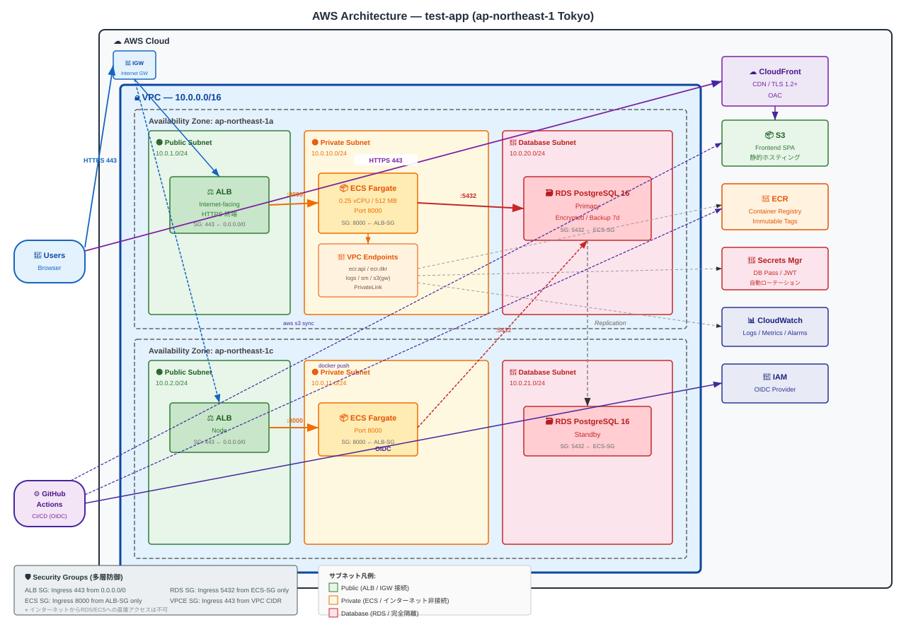

# Terraform 完全解説 + AWS アーキテクチャ設計書

> **対象読者**: Terraform の概念から学びたい方 / AWS リソースの相互関係を体系的に理解したい方  
> **構成**: 前半=Terraform の書き方解説、後半=AWS 設計書（アーキテクチャ図・リソース一覧・コードとの対応表）

---

## 目次

### Part A: Terraform の基礎と書き方
- [A1. Terraform とは何か](#a1-terraform-とは何か)
- [A2. HCL (HashiCorp Configuration Language) の文法](#a2-hcl-hashicorp-configuration-language-の文法)
- [A3. Terraform の基本概念](#a3-terraform-の基本概念)
- [A4. モジュール設計 — コードの再利用](#a4-モジュール設計--コードの再利用)
- [A5. State (状態管理)](#a5-state-状態管理)
- [A6. コマンド体系](#a6-コマンド体系)

### Part B: AWS アーキテクチャ設計書
- [B1. システム全体構成図](#b1-システム全体構成図)
- [B2. ネットワーク設計](#b2-ネットワーク設計)
- [B3. コンピューティング設計](#b3-コンピューティング設計)
- [B4. データベース設計](#b4-データベース設計)
- [B5. フロントエンド配信設計](#b5-フロントエンド配信設計)
- [B6. セキュリティ設計](#b6-セキュリティ設計)
- [B7. CI/CD パイプライン設計](#b7-cicd-パイプライン設計)
- [B8. コードとアーキテクチャの対応表](#b8-コードとアーキテクチャの対応表)

---

# Part A: Terraform の基礎と書き方

## A1. Terraform とは何か

### A1.1 IaC (Infrastructure as Code) の概念

Terraform は **IaC (Infrastructure as Code)** ツールです。AWS コンソールで手作業で行う操作（VPC の作成、DB の構築など）を、コードで定義して自動実行します。

| 比較 | 手動 (コンソール) | IaC (Terraform) |
|------|-----------------|-----------------|
| 操作方法 | GUI でポチポチ | コードを書いて `terraform apply` |
| 再現性 | なし（手順書頼み） | 完全に再現可能 |
| 差分管理 | 不可能 | Git で変更履歴を追跡 |
| レビュー | スクリーンショットで共有 | Pull Request でコードレビュー |
| 環境複製 | 同じ手順を最初からやり直し | 変数を変えて同じコードを適用 |
| 削除 | 1 つずつ手動削除 | `terraform destroy` で一括削除 |

### A1.2 Terraform の動作原理


Terraform は **宣言的** です。「この状態にしてほしい」と書くだけで、Terraform が「現在の状態」との差分を計算し、必要な変更だけを実行します。

---

## A2. HCL (HashiCorp Configuration Language) の文法

Terraform のコードは HCL という言語で書きます。

### A2.1 基本構文

```hcl
# コメント（# で始まる行）

# ブロック構文: type "label1" "label2" { ... }
resource "aws_vpc" "main" {
  cidr_block = "10.0.0.0/16"    # 引数 = 値
  
  tags = {                       # マップ型
    Name = "my-vpc"
  }
}
```

| 要素 | 説明 | 例 |
|------|------|-----|
| `resource` | ブロックタイプ | `resource`, `variable`, `output`, `data`, `module` |
| `"aws_vpc"` | リソースタイプ（プロバイダ_サービス） | `aws_subnet`, `aws_ecs_cluster` |
| `"main"` | ローカル名（同じタイプ内で一意） | コード内での参照に使う |
| `cidr_block` | 引数名 | リソースのパラメータ |
| `= "10.0.0.0/16"` | 引数値 | 文字列、数値、bool、リスト、マップ |

### A2.2 データ型

```hcl
# 文字列
name = "my-app"

# 数値
port = 8000

# 真偽値
multi_az = true

# リスト
availability_zones = ["ap-northeast-1a", "ap-northeast-1c"]

# マップ
tags = {
  Name        = "my-app"
  Environment = "production"
}
```

### A2.3 変数参照と式

```hcl
# 変数の参照
cidr_block = var.vpc_cidr

# リソースの属性参照
vpc_id = aws_vpc.main.id
#        ^^^^^^^^ ^^^^ ^^
#        type     name attribute

# 文字列補間
name = "${var.project_name}-vpc"

# 条件式
deletion_protection = var.environment == "production" ? true : false

# 関数
cidr_block = cidrsubnet(var.vpc_cidr, 8, 1)
# cidrsubnet("10.0.0.0/16", 8, 1) → "10.0.1.0/24"
```

### A2.4 count と for_each（繰り返し）

```hcl
# count: 同じリソースを N 個作る
resource "aws_subnet" "public" {
  count             = 2                      # 2 個作る
  cidr_block        = cidrsubnet("10.0.0.0/16", 8, count.index + 1)
  availability_zone = var.azs[count.index]   # count.index は 0, 1, ...
}
# → aws_subnet.public[0], aws_subnet.public[1] が作成される

# 全要素を参照: aws_subnet.public[*].id → ["subnet-aaa", "subnet-bbb"]
```

---

## A3. Terraform の基本概念

### A3.1 ファイル構成の規約

Terraform は同じディレクトリ内の全 `.tf` ファイルを自動的に結合して処理します。ファイル名は自由ですが、以下が広く使われる規約です:

```
modules/vpc/
├── main.tf          # リソース定義（本体）
├── variables.tf     # 入力パラメータの定義
└── outputs.tf       # 出力値の定義
```

| ファイル | 役割 | 本プロジェクトでの実例 |
|---------|------|---------------------|
| `main.tf` | AWS リソースの `resource` ブロックを記述 | VPC, サブネット, NAT GW 等 |
| `variables.tf` | `variable` ブロックで入力パラメータを定義 | `project_name`, `vpc_cidr` 等 |
| `outputs.tf` | `output` ブロックで他モジュールに渡す値を定義 | `vpc_id`, `subnet_ids` 等 |

### A3.2 variable ブロック

```hcl
# variables.tf の例
variable "project_name" {
  description = "プロジェクト名"    # 説明（ドキュメント用）
  type        = string             # 型
}

variable "vpc_cidr" {
  description = "VPC の CIDR"
  type        = string
  default     = "10.0.0.0/16"     # デフォルト値（省略可能にする）
}

variable "availability_zones" {
  description = "使用する AZ"
  type        = list(string)       # リスト型
  default     = ["ap-northeast-1a", "ap-northeast-1c"]
}
```

### A3.3 output ブロック

```hcl
# outputs.tf の例
output "vpc_id" {
  description = "VPC の ID"
  value       = aws_vpc.main.id   # リソースの属性を参照
}

output "public_subnet_ids" {
  description = "パブリックサブネットの ID リスト"
  value       = aws_subnet.public[*].id   # 全要素のリスト
}
```

### A3.4 resource ブロックの読み方

本プロジェクトの VPC 定義を例に、1 行ずつ解説します:

```hcl
resource "aws_vpc" "main" {
#         ^^^^^^^^  ^^^^
#         |         └── ローカル名（コード内での参照用）
#         └──────────── リソースタイプ（AWS の VPC を作る）

  cidr_block           = var.vpc_cidr
  #                      ^^^^^^^^^^^
  #                      変数 vpc_cidr の値を使う

  enable_dns_support   = true
  enable_dns_hostnames = true
  # DNS サポートを有効化（ECS, RDS が名前解決に必要）

  tags = {
    Name        = "${var.project_name}-vpc"
    Environment = var.environment
  }
  # タグ: AWS コンソールでの識別用
}
```

---

## A4. モジュール設計 — コードの再利用

### A4.1 モジュールとは

モジュールは Terraform コードの「パッケージ」です。関連するリソースをまとめて、再利用可能な部品にします。



### A4.2 モジュールの呼び出し方

```hcl
# environments/production/main.tf

module "vpc" {
  source             = "../../modules/vpc"        # モジュールのパス
  project_name       = var.project_name            # 変数を渡す
  environment        = "production"
  vpc_cidr           = var.vpc_cidr
  availability_zones = var.availability_zones
  aws_region         = var.aws_region
}

module "ecs" {
  source             = "../../modules/ecs"
  project_name       = var.project_name
  vpc_id             = module.vpc.vpc_id           # 他モジュールの output を参照
  private_subnet_ids = module.vpc.private_subnet_ids
  # ...
}
```

**ポイント**:
- `source` でモジュールの場所を指定
- モジュールの `variables.tf` に定義された変数に値を渡す
- 他のモジュールの `output` を `module.モジュール名.output名` で参照
- モジュール間のデータの流れが「配線」のようにつながる

### A4.3 モジュール間のデータフロー



---

## A5. State (状態管理)

### A5.1 State とは

State は「Terraform が管理しているリソースの現在の状態」を記録したファイルです。


### A5.2 リモート State (S3 backend)

本プロジェクトでは State を S3 に保存し、DynamoDB でロックを管理します:

```hcl
# backend.tf
terraform {
  backend "s3" {
    bucket         = "test-app-terraform-state-123456789012"
    key            = "production/terraform.tfstate"
    region         = "ap-northeast-1"
    encrypt        = true
    dynamodb_table = "test-app-terraform-lock"
  }
}
```

| 設定 | 目的 |
|------|------|
| `bucket` | State ファイルの保存先 S3 バケット |
| `key` | バケット内のパス |
| `encrypt` | 暗号化して保存 |
| `dynamodb_table` | 同時実行を防ぐロック機構 |

---

## A6. コマンド体系

| コマンド | 目的 | 安全性 |
|---------|------|--------|
| `terraform init` | プロバイダのダウンロード・State 接続 | 安全 |
| `terraform plan` | 変更内容のプレビュー（実行しない） | 安全 |
| `terraform apply` | 変更を実際に適用 | **要注意** |
| `terraform destroy` | 全リソースを削除 | **危険** |
| `terraform output` | 出力値の表示 | 安全 |
| `terraform fmt` | コードの自動フォーマット | 安全 |
| `terraform validate` | 構文チェック | 安全 |

---

# Part B: AWS アーキテクチャ設計書

## B1. システム全体構成図

### B1.1 アーキテクチャ概要図



### B1.2 ネットワーク構成図



---

## B2. ネットワーク設計

### B2.1 設計方針

| 方針 | 内容 | 理由 |
|------|------|------|
| マルチ AZ | 2 つの AZ に分散配置 | 単一 AZ 障害時の可用性確保 |
| 3 層サブネット | Public / Private / Database | セキュリティの多層防御 |
| VPC エンドポイント | NAT Gateway の代替 | コスト削減（NAT: $32/月/AZ → VPC Endpoint: $7/月/個） |
| プライベートサブネット | ECS タスクはインターネット直接不可 | 攻撃面の最小化 |

### B2.2 サブネット設計

| サブネット | CIDR | 配置リソース | インターネットアクセス |
|-----------|------|------------|---------------------|
| Public (AZ-a) | 10.0.1.0/24 | ALB | あり (IGW) |
| Public (AZ-c) | 10.0.2.0/24 | ALB | あり (IGW) |
| Private (AZ-a) | 10.0.10.0/24 | ECS Fargate | VPC Endpoint のみ |
| Private (AZ-c) | 10.0.11.0/24 | ECS Fargate | VPC Endpoint のみ |
| Database (AZ-a) | 10.0.20.0/24 | RDS (Primary) | なし |
| Database (AZ-c) | 10.0.21.0/24 | RDS (Standby) | なし |

### B2.3 VPC エンドポイント設計

| エンドポイント | タイプ | 用途 | コスト |
|--------------|--------|------|--------|
| S3 | Gateway | ECR イメージレイヤーの取得 | **無料** |
| ECR API | Interface | ECR API 操作 | ~$7/月 |
| ECR DKR | Interface | Docker イメージの pull | ~$7/月 |
| CloudWatch Logs | Interface | ログ送信 | ~$7/月 |
| Secrets Manager | Interface | DB パスワード/JWT 取得 | ~$7/月 |

> **コスト比較**: NAT Gateway 2 台 = ~$64/月 → VPC Endpoint 4 個 = ~$28/月 (56% 削減)

### B2.4 対応する Terraform コード

| 設計要素 | ファイル | リソース名 |
|---------|---------|-----------|
| VPC | `modules/vpc/main.tf` | `aws_vpc.main` |
| パブリックサブネット | `modules/vpc/main.tf` | `aws_subnet.public` |
| プライベートサブネット | `modules/vpc/main.tf` | `aws_subnet.private` |
| DB サブネット | `modules/vpc/main.tf` | `aws_subnet.database` |
| インターネットゲートウェイ | `modules/vpc/main.tf` | `aws_internet_gateway.main` |
| VPC Endpoint (S3) | `modules/vpc/main.tf` | `aws_vpc_endpoint.s3` |
| VPC Endpoint (ECR API) | `modules/vpc/main.tf` | `aws_vpc_endpoint.ecr_api` |
| VPC Endpoint (ECR DKR) | `modules/vpc/main.tf` | `aws_vpc_endpoint.ecr_dkr` |
| VPC Endpoint (Logs) | `modules/vpc/main.tf` | `aws_vpc_endpoint.logs` |
| VPC Endpoint (SM) | `modules/vpc/main.tf` | `aws_vpc_endpoint.secretsmanager` |
| パブリックルートテーブル | `modules/vpc/main.tf` | `aws_route_table.public` |
| プライベートルートテーブル | `modules/vpc/main.tf` | `aws_route_table.private` |

---

## B3. コンピューティング設計

### B3.1 ECS Fargate 構成

| 項目 | 設定値 | 理由 |
|------|--------|------|
| 起動タイプ | Fargate | サーバー管理不要 |
| CPU | 256 (0.25 vCPU) | 最小コスト構成 |
| メモリ | 512 MB | 最小コスト構成 |
| 希望タスク数 | 1 | 開発段階は 1 で十分 |
| ネットワークモード | awsvpc | Fargate 必須 |
| パブリック IP | 無効 | プライベートサブネットに配置 |
| ヘルスチェック | `/api/health/live` | Liveness Probe |

### B3.2 ALB 構成

| 項目 | 設定値 | 理由 |
|------|--------|------|
| タイプ | Application (L7) | HTTP/HTTPS ルーティング |
| スキーム | Internet-facing | 外部からのアクセスを受付 |
| リスナー | HTTPS:443 → ECS:8000 | TLS 終端は ALB で |
| HTTP リスナー | 80 → 443 リダイレクト | 常に HTTPS を強制 |
| ヘルスチェック | `/api/health/live` (200) | 30 秒間隔 |
| TLS ポリシー | TLS13-1-2-2021-06 | TLS 1.2 以上を強制 |

### B3.3 ECR 構成

| 項目 | 設定値 | 理由 |
|------|--------|------|
| イメージタグ | IMMUTABLE | 同じタグでの上書き禁止（デプロイの再現性） |
| スキャン | push 時に自動 | 脆弱性検出 |
| ライフサイクル | 最新 20 イメージ保持 | ストレージコスト削減 |
| 暗号化 | AES256 | 保存時暗号化 |

### B3.4 対応する Terraform コード

| 設計要素 | ファイル | リソース名 |
|---------|---------|-----------|
| ECS クラスタ | `modules/ecs/main.tf` | `aws_ecs_cluster.main` |
| タスク定義 | `modules/ecs/main.tf` | `aws_ecs_task_definition.backend` |
| ECS サービス | `modules/ecs/main.tf` | `aws_ecs_service.backend` |
| タスク実行ロール | `modules/ecs/main.tf` | `aws_iam_role.ecs_execution` |
| タスクロール | `modules/ecs/main.tf` | `aws_iam_role.ecs_task` |
| ALB | `modules/alb/main.tf` | `aws_lb.main` |
| ターゲットグループ | `modules/alb/main.tf` | `aws_lb_target_group.backend` |
| HTTPS リスナー | `modules/alb/main.tf` | `aws_lb_listener.https` |
| HTTP リダイレクト | `modules/alb/main.tf` | `aws_lb_listener.http_redirect` |
| ECR リポジトリ | `modules/ecr/main.tf` | `aws_ecr_repository.backend` |
| ECR ライフサイクル | `modules/ecr/main.tf` | `aws_ecr_lifecycle_policy.backend` |

---

## B4. データベース設計

### B4.1 RDS 構成

| 項目 | 設定値 | 理由 |
|------|--------|------|
| エンジン | PostgreSQL 16.4 | アプリの要件 |
| インスタンスクラス | db.t3.micro | Free Tier 対象 |
| ストレージ | gp3, 20GB (最大 100GB) | Auto Scaling 対応 |
| マルチ AZ | false (開発) / true (本番) | コスト vs 可用性 |
| 暗号化 | 有効 (ストレージ) | データ保護 |
| パブリックアクセス | 無効 | セキュリティ |
| パスワード管理 | Secrets Manager 自動管理 | パスワードの安全な管理 |
| バックアップ | 7 日間保持 / 03:00-04:00 | データ保護 |
| Performance Insights | 有効 | パフォーマンス監視 |

### B4.2 対応する Terraform コード

| 設計要素 | ファイル | リソース名 |
|---------|---------|-----------|
| DB インスタンス | `modules/rds/main.tf` | `aws_db_instance.main` |
| サブネットグループ | `modules/rds/main.tf` | `aws_db_subnet_group.main` |
| セキュリティグループ | `modules/rds/main.tf` | `aws_security_group.rds` |

---

## B5. フロントエンド配信設計

### B5.1 S3 + CloudFront 構成



| 項目 | 設定値 | 理由 |
|------|--------|------|
| S3 パブリックアクセス | 全てブロック | CloudFront 経由のみ許可 |
| OAC | 有効 | S3 への直接アクセス防止 |
| HTTPS | redirect-to-https | 常に暗号化通信 |
| SPA フォールバック | 403/404 → index.html | React Router 対応 |
| キャッシュ (アセット) | 1 年 (immutable) | Vite のハッシュ付きファイル名 |
| キャッシュ (index.html) | no-cache | 常に最新版を取得 |
| TLS | TLSv1.2 以上 | セキュリティ |

### B5.2 対応する Terraform コード

| 設計要素 | ファイル | リソース名 |
|---------|---------|-----------|
| S3 バケット | `modules/s3-cloudfront/main.tf` | `aws_s3_bucket.frontend` |
| パブリックアクセスブロック | `modules/s3-cloudfront/main.tf` | `aws_s3_bucket_public_access_block.frontend` |
| バケットポリシー | `modules/s3-cloudfront/main.tf` | `aws_s3_bucket_policy.frontend` |
| CloudFront OAC | `modules/s3-cloudfront/main.tf` | `aws_cloudfront_origin_access_control.frontend` |
| CloudFront | `modules/s3-cloudfront/main.tf` | `aws_cloudfront_distribution.frontend` |

---

## B6. セキュリティ設計

### B6.1 セキュリティグループ（ファイアウォール）

セキュリティグループは「どの通信を許可するか」を定義する仮想ファイアウォールです。


| セキュリティグループ | Ingress (受信許可) | 配置先 | ファイル |
|-------------------|-------------------|--------|---------|
| ALB SG | 80/443 from 0.0.0.0/0 | ALB | `modules/alb/main.tf` |
| ECS SG | 8000 from ALB SG のみ | ECS タスク | `modules/ecs/main.tf` |
| RDS SG | 5432 from ECS SG のみ | RDS | `modules/rds/main.tf` |
| VPC Endpoint SG | 443 from VPC CIDR | VPC Endpoint | `modules/vpc/main.tf` |

> **多層防御**: インターネット → ALB → ECS → RDS の各層でアクセスを制限。RDS にはインターネットから直接アクセスできません。

### B6.2 IAM 設計

| ロール/ポリシー | 用途 | 権限範囲 | ファイル |
|---------------|------|---------|---------|
| ECS タスク実行ロール | ECS がイメージ pull / ログ出力に使用 | ECR pull + CloudWatch Logs + Secrets Manager | `modules/ecs/main.tf` |
| ECS タスクロール | コンテナ内アプリが使用 | 最小権限（現在は空） | `modules/ecs/main.tf` |
| GitHub Actions デプロイロール | CI/CD がデプロイに使用 | ECR push + ECS update + S3 sync + CloudFront invalidation | `modules/iam/main.tf` |
| OIDC プロバイダ | GitHub → AWS の信頼関係 | 特定リポジトリからのみ AssumeRole 可能 | `modules/iam/main.tf` |

### B6.3 シークレット管理

| シークレット | 管理方法 | 使用場所 |
|------------|---------|---------|
| DB パスワード | Secrets Manager (RDS 自動管理) | ECS タスク定義 (secrets) |
| JWT 秘密鍵 | Secrets Manager (手動作成) | ECS タスク定義 (secrets) |
| AWS 認証情報 | OIDC (一時トークン) | GitHub Actions |

---

## B7. CI/CD パイプライン設計

### B7.1 パイプライン全体図



### B7.2 対応するファイル

| 工程 | ファイル | 行 |
|------|---------|-----|
| CI パイプライン | `.github/workflows/ci.yml` | 全体 |
| CD パイプライン | `.github/workflows/deploy.yml` | 全体 |
| OIDC 認証 | `modules/iam/main.tf` | `aws_iam_openid_connect_provider` |
| デプロイ権限 | `modules/iam/main.tf` | `aws_iam_role.github_actions_deploy` |

---

## B8. コードとアーキテクチャの対応表

### B8.1 完全対応マップ

以下の表は、アーキテクチャ図の各要素がどのファイルのどのリソースで実装されているかを示します。

| アーキテクチャ要素 | AWS サービス | Terraform モジュール | ファイル | リソース名 |
|-------------------|------------|---------------------|---------|-----------|
| **ネットワーク** | | | | |
| 仮想ネットワーク | VPC | vpc | `modules/vpc/main.tf` | `aws_vpc.main` |
| インターネット接続 | Internet Gateway | vpc | `modules/vpc/main.tf` | `aws_internet_gateway.main` |
| パブリックサブネット | Subnet | vpc | `modules/vpc/main.tf` | `aws_subnet.public` |
| プライベートサブネット | Subnet | vpc | `modules/vpc/main.tf` | `aws_subnet.private` |
| DB サブネット | Subnet | vpc | `modules/vpc/main.tf` | `aws_subnet.database` |
| AWS サービス接続 | VPC Endpoint | vpc | `modules/vpc/main.tf` | `aws_vpc_endpoint.*` |
| ルーティング | Route Table | vpc | `modules/vpc/main.tf` | `aws_route_table.*` |
| **ロードバランシング** | | | | |
| L7 ロードバランサー | ALB | alb | `modules/alb/main.tf` | `aws_lb.main` |
| バックエンド振り分け | Target Group | alb | `modules/alb/main.tf` | `aws_lb_target_group.backend` |
| HTTPS 受付 | Listener | alb | `modules/alb/main.tf` | `aws_lb_listener.https` |
| HTTP→HTTPS 転送 | Listener | alb | `modules/alb/main.tf` | `aws_lb_listener.http_redirect` |
| **コンテナ実行** | | | | |
| クラスタ | ECS Cluster | ecs | `modules/ecs/main.tf` | `aws_ecs_cluster.main` |
| コンテナ定義 | Task Definition | ecs | `modules/ecs/main.tf` | `aws_ecs_task_definition.backend` |
| サービス管理 | ECS Service | ecs | `modules/ecs/main.tf` | `aws_ecs_service.backend` |
| ログ | CloudWatch Logs | ecs | `modules/ecs/main.tf` | `aws_cloudwatch_log_group.ecs` |
| **コンテナレジストリ** | | | | |
| イメージ保管 | ECR | ecr | `modules/ecr/main.tf` | `aws_ecr_repository.backend` |
| イメージ整理 | Lifecycle Policy | ecr | `modules/ecr/main.tf` | `aws_ecr_lifecycle_policy.backend` |
| **データベース** | | | | |
| PostgreSQL | RDS | rds | `modules/rds/main.tf` | `aws_db_instance.main` |
| サブネット配置 | DB Subnet Group | rds | `modules/rds/main.tf` | `aws_db_subnet_group.main` |
| **フロントエンド配信** | | | | |
| 静的ファイル保管 | S3 | s3-cloudfront | `modules/s3-cloudfront/main.tf` | `aws_s3_bucket.frontend` |
| CDN | CloudFront | s3-cloudfront | `modules/s3-cloudfront/main.tf` | `aws_cloudfront_distribution.frontend` |
| アクセス制御 | OAC | s3-cloudfront | `modules/s3-cloudfront/main.tf` | `aws_cloudfront_origin_access_control.frontend` |
| **認証・認可** | | | | |
| GitHub 連携 | OIDC Provider | iam | `modules/iam/main.tf` | `aws_iam_openid_connect_provider.github` |
| デプロイ権限 | IAM Role | iam | `modules/iam/main.tf` | `aws_iam_role.github_actions_deploy` |
| ECS 実行権限 | IAM Role | ecs | `modules/ecs/main.tf` | `aws_iam_role.ecs_execution` |
| **セキュリティ** | | | | |
| ALB 保護 | Security Group | alb | `modules/alb/main.tf` | `aws_security_group.alb` |
| ECS 保護 | Security Group | ecs | `modules/ecs/main.tf` | `aws_security_group.ecs` |
| RDS 保護 | Security Group | rds | `modules/rds/main.tf` | `aws_security_group.rds` |
| VPC Endpoint 保護 | Security Group | vpc | `modules/vpc/main.tf` | `aws_security_group.vpc_endpoints` |

### B8.2 環境別構成の呼び出し構造

```
environments/production/main.tf          ← エントリーポイント
  ├── module "vpc"       → modules/vpc/        (7 リソース + 5 VPC Endpoint)
  ├── module "ecr"       → modules/ecr/        (2 リソース)
  ├── module "alb"       → modules/alb/        (4 リソース)
  ├── module "ecs"       → modules/ecs/        (8 リソース)
  ├── module "rds"       → modules/rds/        (3 リソース)
  ├── module "s3_cloudfront" → modules/s3-cloudfront/ (5 リソース)
  └── module "iam"       → modules/iam/        (3 リソース)

environments/production/backend.tf       ← State の保存先設定
environments/production/variables.tf     ← 全変数の定義
environments/production/terraform.tfvars ← 変数の実際の値
environments/production/outputs.tf       ← terraform output で表示される値
```
